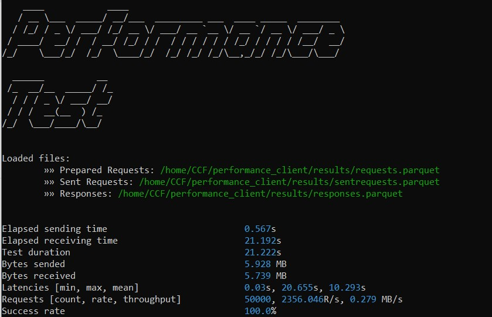

# Performance Testing Client



## Install .NET 5 

Follow the install instructions from the link below:

https://docs.microsoft.com/en-us/dotnet/core/install/linux-ubuntu#2010-

## Instal Python 3.8

https://www.python.org/downloads/release/python-387/

# Download binaries from Release page

Find the released versions [here](https://github.com/WillAllmeida/performance_client/releases). After the binaries download, extract the .tar.gz file to a folder.

# Request Generator
Go to the Generator folder
```
cd Generator/
```

To see all the custom run options type the ``run.sh`` script with --help arg
```
./run.sh --help
```
Example: running generator with default values for target and method args, but with a custom entries amount.
```
./run.sh --entries 50
```

ps: execute the scripts above from the ``Generator`` directory

# Request Sender
Go to the Sender folder
```
cd Sender/
```

To see all the custom run options type the ``run.sh`` script with --help arg
```
./run.sh --help
```

Example: running request sender
```
./run.sh --host 127.0.0.1:8000 --user user0_cert.pem --pk user0_privk.pem --cacert networkcert.pem
```

ps: execute the scripts above from the ``Sender`` directory

# Analyzer

Go to the Analyzer folder
```
cd Analyzer/
```

## Installing Analyzer requirements
Install the analyzer lib requirements with the setup script:
```
./setup.sh
```

## Running Analyzer
To see all the custom run options type the ``run.sh`` script with --help arg
```
./run.sh --help
```
Example: running the analyzer script
```
./run.sh --responsesfile /../results/responses.parquet
```

ps: execute the scripts above from the ``Analyzer`` directory

# Results

The output files generated in the process will be in ``results`` folder. 3 Parquet files are expected, contaning the data about raw requests, sent request and received responses.


## Build the project from source code

- [Develop Setup](docs/developsetup.md)
